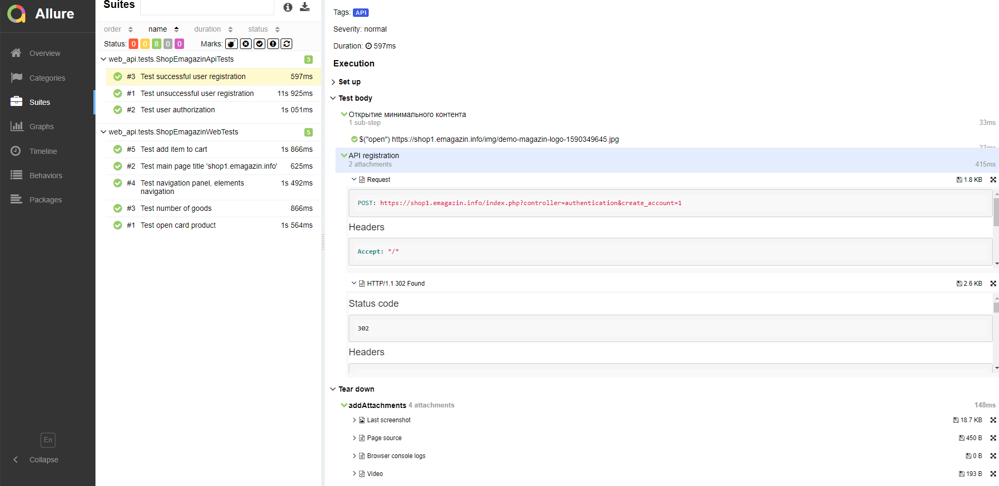

<a href="https://github.com/"></a>
# Демо проект по автоматизации тестирования на Java. Сайт https://shop1.emagazin.info/.


## Содержание :bookmark_tabs:
* <a href="#stack">Cтек технологий</a>
* <a href="#objects">Объекты тестирования</a>
* <a href="#console">Запуск тестов из консоли</a>
* <a href="#code">Код</a>
    + <a href="#intelij">InteliJ IDEA, Java, JUnit 5, Selenide, Rest Assured</a>
    + <a href="#gradle">Gradle</a>
* <a href="#screenshot">Скриншоты</a>
  + <a href="#jenkins">Jenkins</a>
  + <a href="#allure">Allure TestOps, Allure Report</a>
  + <a href="#notifications">Telegram</a>


<a id="stack"></a>
## Cтек технологий :hammer_and_wrench:

<div align="center">
<a href="https://www.jetbrains.com/idea/"></a>
<a href="https://www.java.com/"></a>
<a href="https://junit.org/junit5/"></a>
<a href="https://selenide.org/"></a>
<a href="https://rest-assured.io/"></a>
<a href="https://aerokube.com/selenoid/"></a>
<a href="https://gradle.org/"></a>
<a href="https://www.jenkins.io/"></a>
<a href="https://qameta.io/"></a>
<a href="https://github.com/allure-framework/"></a>
<a href="https://github.com/"></a>
</div>


<a id="objects"></a>
## Объекты тестирования :mag:

Разработаны автотесты для проверок:

* UI:

:white_check_mark: Test main page title 'shop1.emagazin.info - Проверка титульной части страницы. 

:white_check_mark: Test navigation panel elements navigation - Проверка перехода по элементам  в навигационной панели. 

:white_check_mark: Test number of goods - Проверка количества товаров. 

:white_check_mark: Test open card product - Проверка открытия карточка товара. 

:white_check_mark: Test add item to cart - Проверка добавление товара в корзину.

* API + UI:

:white_check_mark: Test user authorization - проверка авторизации пользователя.

* API:

:white_check_mark: Test successful user registration - Проверка удачной регистрации пользователя. 

:white_check_mark: Test unsuccessful user registration - Проверка не удачной регистрации пользователя. 


<a id="console"></a>
## Запуск тестов из консоли :computer:

```bash
gradle clean 
-Dbrowser=${BROWSER}
-DbrowserSize=${BROWSER_SIZE}
-Dhost=${HOST}

```

> 
> 
> `${BROWSER}` - браузер [ *chrome* <sub>(default)</sub> , *firefox*, *opera*]
> 
> `${BROWSER_SIZE}` - размер окна браузера  [ *1920x1080* <sub>(default)</sub>]
>
> `${HOST}` - хост прогона тестов [ *remote* <sub>(default)</sub> , *local* ]


<a id="code"></a>
## Код :floppy_disk:

<a id="intelij"></a>
#### InteliJ IDEA</a>Java</a>JUnit 5</a>Selenide</a>Rest Assured</a>

> *Оформление кода автотестов*

```java


public class ShopEmagazinWebTests extends TestBase {
    
  @Test
  @Tag("WEB")
  @DisplayName("Check navigation panel elements transition")
  void checkMenuElementsTest() {
    step("Open the main page", ()
            -> open(baseUrl));

    step("Check, transition element 'Одежда'", () -> {
      mainPage.navigationMenu(testData.menuClothes);
    });

    step("Check, transition element 'Сопутствующие товары'", () -> {
      mainPage.navigationMenu(testData.menuRelatedProd);
    });

    step("Check, transition element 'Картины'", () -> {
      mainPage.navigationMenu(testData.menuPaintings);
    });
  }
```


<a id="gradle"></a>
#### Gradle</a>

> *Автоматическая сборка проекта и управление зависимостями*

```groovy
plugins {
  id 'java-library'
  id 'io.qameta.allure' version '2.10.0'
  id 'io.freefair.lombok' version '6.0.0-m2'
}

repositories {
  mavenCentral()
}

def allureVersion = "2.23.0",
    selenideVersion = "6.15.0",
    junitVersion = "5.8.2",
    aspectjweaverVersion = "1.9.6",
    javafakerVersion = "1.0.2",
    restAssuredVersion = "5.3.0",
    ownerVersion = "1.0.12",
    assertjCoreVersion = "3.19.0",
    slf4jSimpleVersion = "2.0.7"


dependencies {
  testImplementation(
          "org.aspectj:aspectjweaver:$aspectjweaverVersion",
          "com.github.javafaker:javafaker:$javafakerVersion",
          "com.codeborne:selenide:$selenideVersion",
          "io.qameta.allure:allure-selenide:$allureVersion",
          "io.rest-assured:rest-assured:$restAssuredVersion",
          "io.qameta.allure:allure-rest-assured:$allureVersion",
          "org.aeonbits.owner:owner:$ownerVersion",
          "org.assertj:assertj-core:$assertjCoreVersion",
          "org.slf4j:slf4j-simple:$slf4jSimpleVersion",
          "org.junit.jupiter:junit-jupiter:$junitVersion")
}
```


<a id="screenshot"></a>
## Скриншоты :camera_flash:

<a id="jenkins"></a>
#### Jenkins</a>

> *Решение комплекса задач по сборке проекта, прогону автотестов, получению отчетов и отправке уведомлений по
результатам сборки*

<a href="https://jenkins.autotests.cloud/job/qa_guru_diplom_UI_API/">

</a>


<a id="allure"></a>
#### Allure TestOps</a>Allure Report</a>

> *Формирование отчетов по результам прогона автотестов*

<table>
     <tr>
        <td>
        <a href="https://allure.autotests.cloud/project/3507/dashboards">
        
        </a>
        </td>
        <td>
        <a href="https://allure.autotests.cloud/project/3507/test-cases?treeId=0">
        
        </a>
        </td>
    </tr>
    <tr>
        <td>
        <a href="https://jenkins.autotests.cloud/job/diplom_QA_Guru_Dmitry_O/allure/">
        
        </a>
        </td>
        <td>
        <a href="https://jenkins.autotests.cloud/job/diplom_QA_Guru_Dmitry_O/allure/#suites/">
        
        </a>
        </td>
    </tr>
    <tr>
        <td>
        <a href="https://jenkins.autotests.cloud/job/diplom_QA_Guru_Dmitry_O/allure/#timeline">
        
        </a>
        </td>
        <td>
        <a href="https://jenkins.autotests.cloud/job/diplom_QA_Guru_Dmitry_O/allure/#graph">
        
        </a>
        </td>
</table>


<a id="notifications"></a>
#### Telegram</a>

> *Предоставление оперативной информации о результатах прогона автотестов*

<table>
     <tr>
        <td>
        
        </td>
    </tr>
 </table>   


#### </a> Видео с запуском тестов

### Для всех тестов записано видео


